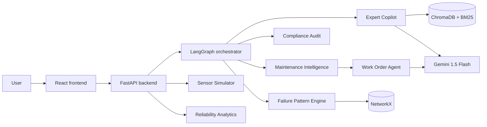

# OPSIQ 3.0
### Enterprise Industrial AI Operations Intelligence Platform

<p align="center">
  
  
  
  
  
  
  
  
</p>

> ET AI Hackathon 2.0 · Phase 2 · Problem Statement #8
> 60,977 registered participants

**[Live Platform](https://opsiq-one.vercel.app)** · **[API Documentation](https://opsiq-production-b20c.up.railway.app/docs)** · **[Benchmark Results](#evaluation-results)**

## Platform Overview

OPSIQ 3.0 is an Industrial AI Operations Intelligence Platform for energy, manufacturing, oil and gas, and critical-infrastructure demonstrations. It combines hybrid RAG, multi-agent routing, simulated sensor intelligence, incident similarity, maintenance analytics, and draft work-order automation to turn fragmented records into traceable operational intelligence.

## Core Capabilities

| Capability | Description |
|---|---|
| Expert Knowledge Copilot | BM25 + dense retrieval, cross-encoder reranking, citations and confidence gating |
| Multilingual Support | Hindi, Marathi, Tamil, Telugu, Gujarati and Bengali query translation with responses in the selected language |
| Maintenance Intelligence | Transparent six-component recurrence-risk scoring from work-order evidence |
| Sensor Monitor | Simulated fleet telemetry, alarm thresholds and trend analysis |
| Compliance Audit | OISD-118 synthetic evidence-gap assessment with a derived compliance percentage |
| Failure Pattern Engine | NetworkX correlation across work orders and recovered incident records |
| Incident Similarity | Jaccard text similarity plus equipment weighting |
| Work Order Generation | Engineer-reviewable drafts from risk analysis and similar incidents |
| Reliability Analytics | Evidence-derived MTBF, MTTR, availability estimates and downtime trends |
| Retrieval Benchmark | Five-query evaluation with confidence, latency and keyword coverage |
| Audit Trail | Privacy-preserving in-memory query-event log |

## Architecture



FastAPI exposes the existing specialist routes plus sensor and reliability APIs. Four LangGraph specialists handle routed analysis; the work-order agent consumes deterministic maintenance output and similar-incident evidence. ChromaDB persists dense vectors, BM25 provides sparse ranking, NetworkX supports pattern relationships, and Gemini is optional for synthesis.

## Judging Criteria Alignment

| Criterion | Weight | OPSIQ 3.0 approach |
|---|---:|---|
| Innovation | 25% | Multilingual industrial RAG, explainable scoring and simulated telemetry in one platform |
| Business Impact | 25% | Faster evidence retrieval, reliability metrics and reviewable work-order drafts |
| Technical Excellence | 20% | Four-agent LangGraph, hybrid retrieval, reranking and evidence-gated synthesis |
| Scalability | 15% | Dockerized Railway backend, configurable persistence and stateless polling APIs |
| User Experience | 15% | Responsive multi-page UI with live refresh, explicit loading, error and no-data states |

## Evaluation Results

Run `GET /api/benchmark/run` to produce results from the current runtime and indexed evidence. OPSIQ reports measured retrieval confidence, response time and keyword coverage; no fixed benchmark result is claimed in this README.

## Quick Start

```bash
git clone https://github.com/tauqxxr7/opsiq.git
cd opsiq/backend
python -m venv .venv
# Windows: .venv\Scripts\activate
# macOS/Linux: source .venv/bin/activate
pip install -r requirements.txt
uvicorn main:app --reload --port 8000

# New terminal
cd frontend
npm install
npm run dev
```

Set `GEMINI_API_KEY` in a local `.env` to enable synthesis and translation. See [DEPLOYMENT.md](DEPLOYMENT.md) for Railway and Vercel configuration.

## Limitations

- All operational records are synthetic demonstration data.
- Sensor readings are simulated and are not connected to SCADA, DCS or historians.
- Maintenance output is historical recurrence analytics, not a trained failure-prediction model.
- Availability is an illustrative estimate based on recorded downtime, not total observed operating time.
- Compliance is a prototype evidence-gap assessment for synthetic OISD-118 records, not legal certification.
- Translation and generative work-order enrichment require a Gemini API key; deterministic fallbacks remain available without one.
- Generated work orders are drafts and require qualified engineer approval before execution.
- Incident, work-order and user persistence uses SQLite for this single-instance demonstration; PostgreSQL, tenancy and refresh-token revocation remain enterprise roadmap items.
- JWT/RBAC is environment-gated so the public synthetic demonstration can remain accessible; production access control requires both backend and frontend auth flags plus a strong secret.

## Built By

**Tauqeer Sameer Bharde**
B.Tech — AI & Data Science
SIES Graduate School of Technology, Navi Mumbai
[github.com/tauqxxr7](https://github.com/tauqxxr7)
