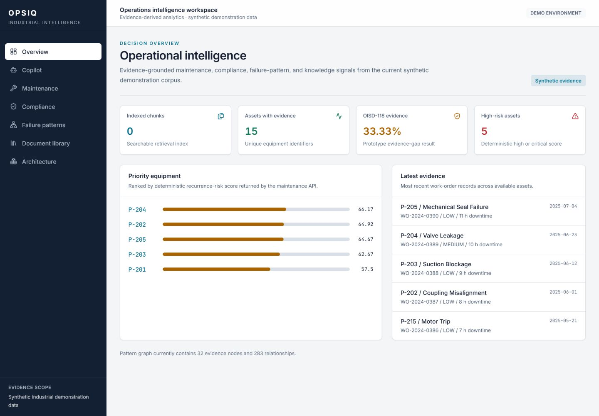
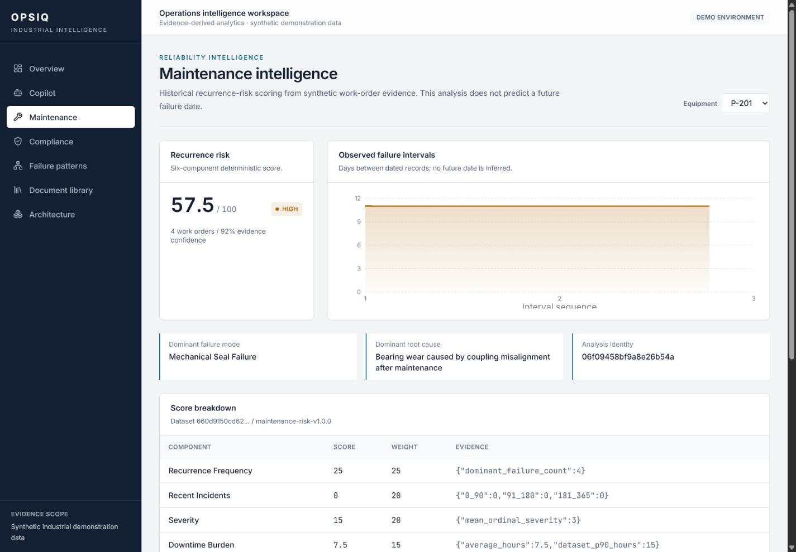
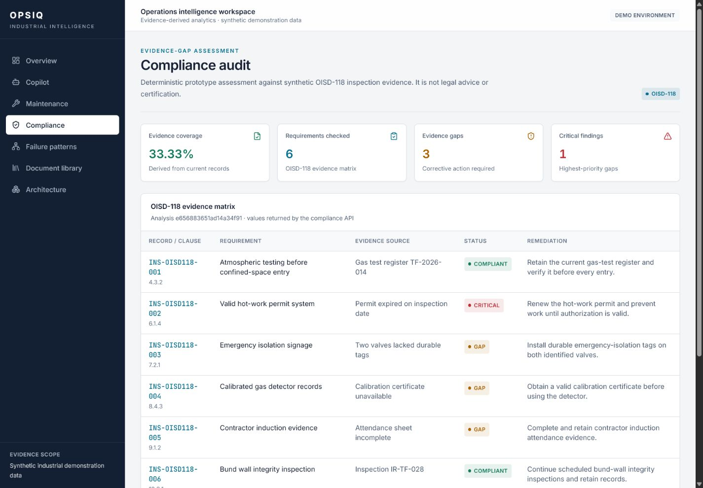

# OPSIQ submission deck

---

## Page 1 — OPSIQ

**Evidence-grounded industrial intelligence for maintenance, compliance, failure-pattern analysis, and engineering knowledge retrieval.**

Production-deployed prototype · ET AI Hackathon 2.0 · Problem Statement #8

---

## Page 2 — Industrial problem

Operational evidence is distributed across work orders, inspections, incidents, manuals, and standards. Manual search and cross-referencing slow engineering review and make knowledge transfer difficult.

OPSIQ provides one evidence layer without replacing source systems.

---

## Page 3 — Solution

- grounded document retrieval with citations;
- deterministic recurrence-risk analysis;
- prototype compliance evidence-gap assessment;
- cross-source failure-pattern investigation;
- evidence IDs, hashes, versions, and reproducible analysis identities.

---

## Page 4 — Architecture

React/Vite → FastAPI → LangGraph routing → four specialist workflows.  
ChromaDB and BM25 retrieve evidence; a cross-encoder reranks passages; optional Gemini synthesizes retrieved context. Deterministic agents calculate specialist results.

See [architecture](architecture.md).

---

## Page 5 — Evidence-first analytics

P-201 risk is derived from recurrence, recency, severity, downtime, repeated root cause, and interval trend. Compliance and pattern outputs also identify their supporting records. Missing evidence returns `no_data`.

---

## Page 6 — Live results

Verified public routes display live backend data for dashboard metrics, P-201 maintenance, OISD-118 evidence gaps, failure patterns, and document inventory.

---

## Page 7 — Limitations and roadmap

**Current:** synthetic evidence, narrow OISD-118 scope, no authentication or tenancy, small regression evaluation, and no live telemetry.

**Next:** controlled plant-data validation, access control, tenant isolation, retrieval evaluation, asynchronous ingestion, human approval workflows, security hardening, and enterprise connectors.

---

## Page 8 — Explore OPSIQ

- Application: https://opsiq-one.vercel.app
- API documentation: https://opsiq-production-b20c.up.railway.app/docs
- Repository: https://github.com/tauqxxr7/opsiq
- Author: Tauqeer Bharde — https://github.com/tauqxxr7

Released under the MIT License.
